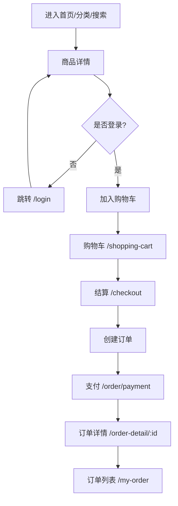
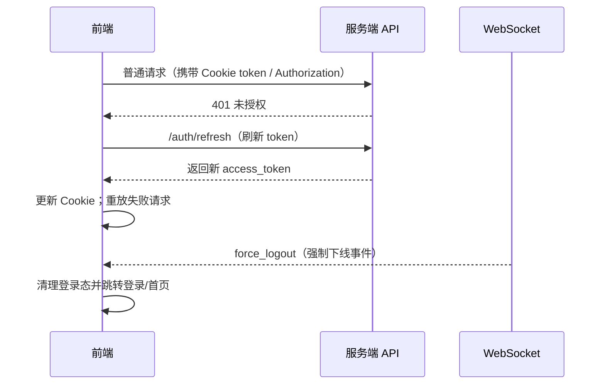

# Lenovo Shop（lenovo-shop）产品文档

> 面向 C 端的电商 Web 应用：商品浏览/搜索、秒杀与新品、购物车下单支付、订单与售后、评价、优惠券中心、用户中心，以及 WebSocket 驱动的实时通知/强制下线等能力。

---

## 目录

- [1. 一句话概览](#1-一句话概览)
- [2. 产品定位与目标](#2-产品定位与目标)
- [3. 核心能力总览（可视化矩阵）](#3-核心能力总览可视化矩阵)
- [4. 业务信息架构（页面地图）](#4-业务信息架构页面地图)
- [5. 关键用户旅程（流程图）](#5-关键用户旅程流程图)
- [6. 权限与登录态（路由保护）](#6-权限与登录态路由保护)
- [7. 实时能力（WebSocket + 多标签协调）](#7-实时能力websocket--多标签协调)
- [8. 前端架构与技术栈](#8-前端架构与技术栈)
- [9. 接口依赖与模块划分](#9-接口依赖与模块划分)
- [10. 环境变量与配置](#10-环境变量与配置)
- [11. 本地开发/构建/发布](#11-本地开发构建发布)
- [12. 可观测性与错误处理](#12-可观测性与错误处理)
- [13. 常见问题（FAQ）](#13-常见问题faq)

---

## 1. 一句话概览

`lenovo-shop` 是一个基于 **React 19 + React Router 7 + Vite 7 + Ant Design 6 + TailwindCSS** 的电商前台站点，支持从浏览到下单、支付、订单管理、售后、评价与优惠券的完整购买闭环，并具备 WebSocket 实时协同能力。

---

## 2. 产品定位与目标

### 面向用户

- 普通消费者（Web / 移动端浏览器）

### 目标

- 提供稳定顺畅的商品购买闭环（浏览 → 加购 → 结算 → 支付 → 履约 → 售后）
- 提供营销触点（优惠券中心、秒杀、新品）
- 提供用户资产沉淀（用户中心、咨询、评价）
- 提供实时通知与安全控制（WebSocket、强制下线、多端登录提示）

---

## 3. 核心能力总览（可视化矩阵）

| 模块 | 能力点 | 对应页面/路由（摘取） | 备注 |
|---|---|---|---|
| 认证与账号 | 登录/注册、登录态生命周期、受保护路由 | `/login` `/register` | 已登录访问登录页会被重定向（HavingLoginRoute） |
| 首页与导购 | 首页信息流、分类导购 | `/` `/index` `/products/:type` `/more-products` | 典型导购链路 |
| 商品 | 商品卡片列表、新品、搜索、详情（上架/秒杀） | `/new-product` `/search` `/product/:id` | 详情分「上架商品」与「秒杀商品」接口 |
| 秒杀 | 秒杀列表/入口 | `/flash-sale` | 对应 `GET_SECKILL_PRODUCT` |
| 购物车/结算 | 加购、购物车列表、结算 | `/shopping-cart` `/checkout` | 需要登录 |
| 订单 | 订单列表、订单详情、支付页、取消订单 | `/my-order` `/order-detail/:id` `/order/payment` | 需要登录 |
| 优惠券 | 领券中心、我的券/代金券 | `/coupon-center` | 商品可用券查询（按 productId） |
| 评价 | 查看评价、点赞评价、提交评价 | `/evaluate` | 需要登录；点赞接口 `EVALUATION_LIKE` |
| 售后/投诉 | 售后详情、申请售后、投诉 | `/after-sale/:id` `/after-sale/apply` `/after-sale/complaint` | 需要登录 |
| 用户中心 | 个人信息、头像上传、密码/邮箱、地址管理等 | `/user-center` | 需要登录 |
| 咨询 | 咨询列表、我的咨询（客服/咨询流） | `/consult` `/my-consult/:customerId` | WebSocket 能力可能用于实时消息 |
| 可靠性/安全 | Token 自动刷新、多端登录提示、强制下线 | 全局 | Axios 拦截器 + WS `force_logout` |

---

## 4. 业务信息架构（页面地图）

下面按路由把用户能看到的“站点地图”画出来（✅表示需要登录）：

```text
入口
├─ /, /index                          首页（导购）
├─ /products/:type                    分类/列表
├─ /more-products                     更多商品
├─ /new-product                       新品
├─ /search                            搜索
├─ /flash-sale                        秒杀
├─ /product/:id                       商品详情
├─ /coupon-center                     优惠券中心
├─ /login                             登录（已登录会跳转）
└─ /register                          注册（已登录会跳转）

交易闭环
├─ ✅ /shopping-cart                   购物车
├─ ✅ /checkout                        结算
├─ ✅ /order/payment                   支付页
├─ ✅ /my-order                        订单列表
└─ ✅ /order-detail/:id                订单详情

售后与评价
├─ ✅ /after-sale/:id                  售后详情
├─ ✅ /after-sale/apply                申请售后
├─ ✅ /after-sale/complaint            投诉
└─ ✅ /evaluate                        评价

用户域
├─ ✅ /user-center                     用户中心
├─ /consult                           咨询列表
└─ ✅ /my-consult/:customerId          我的咨询

兜底
└─ *                                  404
```

---

## 5. 关键用户旅程（流程图）

### 5.1 购买链路（浏览 → 支付）



### 5.2 登录态（Token 刷新 + 强制下线）



---

## 6. 权限与登录态（路由保护）

项目通过 `src/component/ProtectedRoute.tsx` 提供两种路由守卫：

- `ProtectedRoute`：未登录则 `Navigate` 到指定 `redirectTo`（默认 `/`）
- `HavingLoginRoute`：已登录访问登录/注册页会被重定向（避免重复登录）

> 说明：当前 `src/store/authStore.ts` 初始化 `isAuthenticated: true`，更像是开发态默认放行。若要上线，需要把默认值改为 `false`，并在登录成功后调用 `login()`。

---

## 7. 实时能力（WebSocket + 多标签协调）

`src/services/ws/WebSocketProvider.tsx` 提供：

- **WebSocket 连接管理**：自动重连、心跳、队列缓冲
- **多标签页协调**：通过 `BroadcastChannel` 在多个浏览器标签间选举“leader”
	- leader 负责建立 WebSocket 连接并广播消息给其他标签
	- 非 leader 通过广播请求 leader 代发消息
- **安全事件**：接收 `force_logout` 后触发 `axiosService.forceLogout()`

典型价值：

- 降低多标签重复连接带来的服务端压力
- 用户在多个标签页操作时，消息与强制下线保持一致

---

## 8. 前端架构与技术栈

### 核心技术

- 构建：Vite
- UI：Ant Design + TailwindCSS
- 路由：React Router
- 状态：Zustand（带持久化）
- 表单：React Hook Form + Zod
- 网络：Axios（封装在 `AxiosService`）
- 实时：react-use-websocket + BroadcastChannel
- 动效：Framer Motion

### 目录约定（建议阅读顺序）

```text
src/
	pages/          业务页面（路由入口）
	component/      通用组件 & 业务组件
	services/       API/WS 封装与业务 service
	store/          Zustand 状态
	utils/          工具函数
	assets/         静态资源与配置片段
```

---

## 9. 接口依赖与模块划分

### API 路由常量

- 位置：`src/services/apiPaths.ts`
- 包含：认证、用户、商品列表/详情/评价、购物车、优惠券、订单、地址等路径

### Axios 封装（关键点）

- 位置：`src/services/AxiosService.ts`
- 特性：
	- baseURL 来自 `VITE_SERVER_API_BASE_URL`，默认拼接 `/api`
	- `withCredentials: true`
	- token 存在 Cookie：`access_token`
	- 401 自动刷新 token，并自动重放失败请求
	- 支持设备信息注入（`deviceCheck`）
	- 多端登录提醒：`multi_login_warning`

> 注意：Cookie 写入的安全属性（Secure/SameSite）会影响本地调试与跨域场景，详见 FAQ。

---

## 10. 环境变量与配置

本项目目前存在 `lenovo-shop/.env.development`（开发环境）。关键字段如下：

| 变量 | 含义 | 示例/当前值 |
|---|---|---|
| `VITE_PUBLIC_URL` | 前端部署 base | `/` |
| `VITE_ROLL_FOLDER` | 轮播图目录 | `images/roll` |
| `VITE_SERVER_API_BASE_URL` | API 服务地址（会拼 `/api`） | `https://api.jxutcm.top` |
| `VITE_SERVER_PUBLIC_URL` | 服务端 public 静态资源域 | `https://api.jxutcm.top` |
| `VITE_IMAGES_FOLDER` | 商品图静态目录 | `static/images/lenovo` |
| `VITE_USER_AVATAR_FOLDER` | 头像静态目录 | `static/images/user/avatar` |
| `VITE_WS_URL` | WebSocket 地址 | `ws://localhost/ws` |

---

## 11. 本地开发/构建/发布

### 11.1 开发环境

1) 安装依赖（使用 pnpm）

```powershell
pnpm install
```

2) 本地启动

```powershell
pnpm dev
```

默认 Vite 端口：`3000`（见 `vite.config.ts`）。

### 11.2 构建与预览

```powershell
pnpm build
pnpm preview
```

---

## 12. 可观测性与错误处理

### 用户可见反馈

- Toast：`react-hot-toast`（全局 `Toaster` 在 `src/App.tsx`）

### 典型错误场景

- API 401：自动触发 refresh token 流程；刷新失败会执行强制登出逻辑
- WebSocket token 变化：监听 `token-refreshed` 事件，主动 close 触发重连

---

## 13. 常见问题（FAQ）

### Q1：为什么我没登录也能访问需要登录的页面？

检查 `src/store/authStore.ts`：默认 `isAuthenticated: true`。这是开发态的默认放行配置。上线建议：

- 初始化改为 `false`
- 登录成功后调用 `login()`
- 登出/refresh 失败时调用 `logout()`

### Q2：本地调试时 Cookie/跨域导致接口不通怎么办？

本项目 Axios 使用 `withCredentials: true`，并把 token 写在 Cookie。若后端跨域且 Cookie 未正确设置 `SameSite=None; Secure`，浏览器可能拒收/拒发 Cookie。

排查顺序：

1) 浏览器 DevTools → Application → Cookies，确认是否写入 `access_token`
2) Network 查看响应头是否包含 `Set-Cookie`，以及 SameSite/Secure 是否符合跨站场景
3) 确认 `VITE_SERVER_API_BASE_URL` 与前端域名是否同站

### Q3：WebSocket 连不上？

检查 `VITE_WS_URL`：当前为 `ws://localhost/ws`。

- 需要确保本地/测试环境有对应 WS 服务
- WS 连接需要 token：如果没有 `access_token`，Provider 会暂停连接（返回 null）

---

## 维护者提示（给二次开发）

- 路由入口在 `src/App.tsx`，新增页面建议保持：`pages/` + `lazy()` + `Routes` 配置
- 新增接口建议先补 `src/services/apiPaths.ts`，再在 `src/services/*` 添加 service 函数
- 实时消息类型建议集中维护在 `src/services/ws/types.ts` 与 router（`MessageRouter`）

