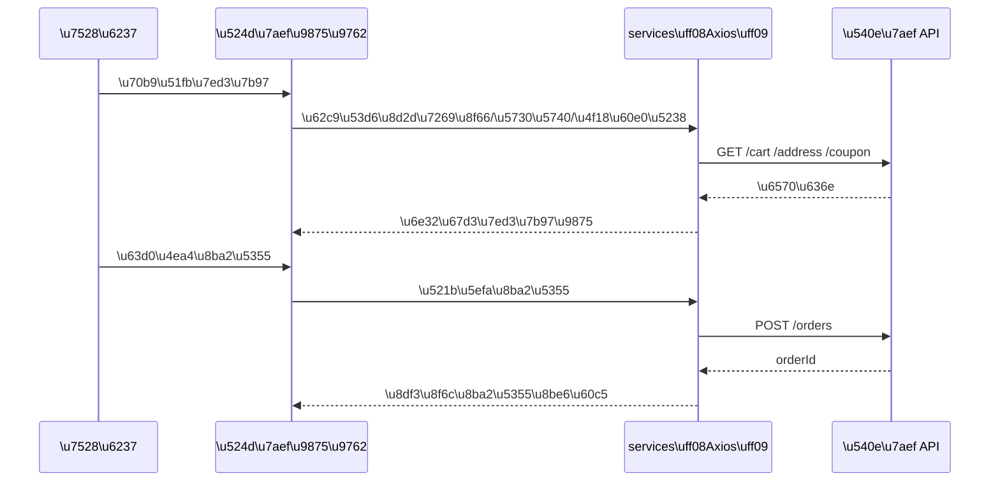
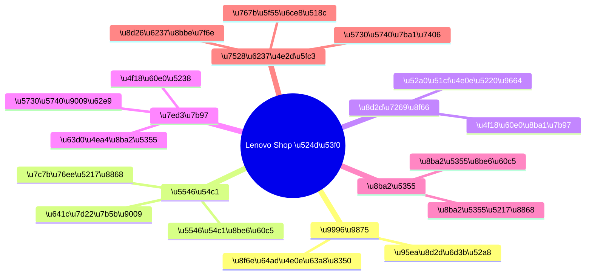

# 🛒 Lenovo Shop - 联想官方商城

<div align="center">


**联想官方旗舰电商平台 - 打造极致购物体验**

[📖 快速开始](#-快速开始) • [🏗️ 项目架构](#-项目架构) • [📁 文件结构](#-文件结构) • [🎯 功能特性](#-功能特性) • [🛠️ 开发指南](#-开发指南) • [📋 TODO 清单](#-todo-清单)

</div>
# Lenovo Shop \uff08\u524d\u53f0\u5546\u57ce\u524d\u7aef\uff09

<div align="center">

<p>
  <a href="#-%E5%BF%AB%E9%80%9F%E4%BD%93%E9%AA%8C">\u5feb\u901f\u4f53\u9a8c</a> \u00b7
  <a href="#-%E4%BA%A7%E5%93%81%E8%A7%86%E8%A7%92">\u4ea7\u54c1\u89c6\u89d2</a> \u00b7
  <a href="#-%E4%B8%9A%E5%8A%A1%E4%B8%8E%E6%B5%81%E7%A8%8B">\u4e1a\u52a1\u4e0e\u6d41\u7a0b</a> \u00b7
  <a href="#-%E6%9E%B6%E6%9E%84%E4%B8%8E%E5%AF%B9%E6%8E%A5">\u67b6\u6784\u4e0e\u5bf9\u63a5</a> \u00b7
  <a href="#-%E5%BC%80%E5%8F%91%E8%A7%84%E8%8C%83">\u5f00\u53d1\u89c4\u8303</a> \u00b7
  <a href="#-%E5%B8%B8%E8%A7%81%E9%97%AE%E9%A2%98">\u5e38\u89c1\u95ee\u9898</a>
</p>

<p>

  
  
  
  
  

</p>

</div>

> \u5b9a\u4f4d\uff1a\u7528\u6237\u4fa7\uff08C\u7aef\uff09\u5546\u57ce\u524d\u7aef\uff0c\u652f\u6301\u79fb\u52a8\u7aef\u4e3a\u4e3b\uff0c\u517c\u5bb9\u6d4f\u89c8\u5668\u9875\u9762\u6d4f\u89c8\u3002

---

## \u2705 \u5feb\u901f\u4f53\u9a8c

> \u76ee\u6807\uff1a\u4ece\u521a clone \u5230\u6253\u5f00\u9996\u9875\uff0c\u5c3d\u91cf\u5c11\u8bfb\u6587\u5b57\uff0c\u8ddf\u7740\u505a\u5c31\u80fd\u8dd1\u3002

```powershell
cd d:\Repo\lenovo-shop
pnpm install
pnpm dev
```

| \u9879\u76ee | \u9ed8\u8ba4\u503c | \u8bf4\u660e |
|---|---:|---|
| dev server | http://localhost:3000 | \u7531 `vite.config.ts` \u914d\u7f6e |

---

## \ud83e\udde9 \u4ea7\u54c1\u89c6\u89d2

### \u4ea7\u54c1\u80fd\u529b\u5730\u56fe\uff08\u529f\u80fd\u5361\u7247\uff09

| \u57df | \u529f\u80fd\u5361\u7247 | \u7528\u6237\u7ed3\u679c |
|---|---|---|
| \u8d2d\u7269 | \u9996\u9875\u63a8\u8350 \u00b7 \u5206\u7c7b\u6d4f\u89c8 \u00b7 \u641c\u7d22\u7b5b\u9009 | \u5feb\u901f\u627e\u5230\u5546\u54c1 |
| \u8f6c\u5316 | \u5546\u54c1\u8be6\u60c5 \u00b7 \u52a0\u8d2d\u7269\u8f66 \u00b7 \u7ed3\u7b97\u4e0b\u5355 | \u5b8c\u6210\u8d2d\u4e70 |
| \u4f18\u60e0 | \u4f18\u60e0\u5238 \u00b7 \u95ea\u8d2d\u6d3b\u52a8 | \u63d0\u5347\u5ba2\u5355\u4e0e\u8d2d\u4e70\u610f\u613f |
| \u5c65\u7ea6 | \u8ba2\u5355\u5217\u8868 \u00b7 \u8ba2\u5355\u8be6\u60c5 \u00b7 \u8fde\u7eed\u8ddf\u8e2a | \u8ba2\u5355\u8fc7\u7a0b\u53ef\u89c6\u5316 |
| \u8d26\u6237 | \u767b\u5f55\u6ce8\u518c \u00b7 \u5730\u5740\u7ba1\u7406 \u00b7 \u7528\u6237\u4e2d\u5fc3 | \u6c89\u6dc0\u4e0e\u590d\u8d2d |

### \u7528\u6237\u65c5\u7a0b\u4e00\u5f20\u56fe

```mermaid
flowchart LR
  A[\u8fdb\u5165\u9996\u9875] --> B[\u6d4f\u89c8\u5206\u7c7b / \u63a8\u8350]
  B --> C[\u641c\u7d22\u5546\u54c1]
  C --> D[\u5546\u54c1\u8be6\u60c5]
  D --> E[\u52a0\u5165\u8d2d\u7269\u8f66]
  E --> F[\u7ed3\u7b97]\n+  F --> G[\u586b\u5199\u5730\u5740 / \u4f18\u60e0\u5238]
  G --> H[\u63d0\u4ea4\u8ba2\u5355]\n+  H --> I[\u8ba2\u5355\u8ddf\u8e2a / \u7528\u6237\u4e2d\u5fc3]
```

---

## \ud83e\udded \u4e1a\u52a1\u4e0e\u6d41\u7a0b

### \u5173\u952e\u4e1a\u52a1\u573a\u666f\uff08\u7ed3\u7b97\u4e3a\u4f8b\uff09



### \u9875\u9762\u5730\u56fe\uff08\u9762\u5411\u4ea7\u54c1/\u6d4b\u8bd5\u7684\u5b9a\u4f4d\uff09

> \u672c\u9879\u76ee\u9875\u9762\u4ee5 `src/pages/` \u4e3a\u4e3b\uff1b\u903b\u8f91\u7b56\u7565\u7c7b\u7684\u901a\u7528\u529f\u80fd\u5206\u6563\u5728 `component/` `services/` `store/` `hooks/`\u3002



---

## \ud83e\uddf1 \u67b6\u6784\u4e0e\u5bf9\u63a5

### \u524d\u7aef\u5206\u5c42\u4e00\u5f20\u56fe

```mermaid
flowchart TB
  UI[pages & component] --> H[hooks]
  UI --> ST[store\n(zustand/context)]
  H --> ST
  UI --> SV[services\n(axios)]
  SV --> API[Backend API]
  UI --> AS[assets\n(static/data)]
  classDef box fill:#0b1220,stroke:#2b3a55,color:#cbd5e1;
  class UI,H,ST,SV,API,AS box;
```

### \u5bf9\u63a5\u540e\u7aef\uff08Lenovo-Shop-Server\uff09

| \u9884\u671f\u6574\u5408 | \u5efa\u8bae\u8def\u5f84 | \u8bf4\u660e |
|---|---|---|
| API Base URL | `VITE_API_BASE_URL` | \u914d\u7f6e\u4e3a\u540e\u7aef\u670d\u52a1\u5730\u5740\uff0c\u4f8b\uff1a`http://localhost:xxxx` |
| \u767b\u5f55\u6001 | Cookie / LocalStorage | \u4f7f\u7528 `js-cookie`\uff0c\u8be6\u60c5\u4ee5 `src/services/` \u5b9e\u73b0\u4e3a\u51c6 |
| WebSocket | `VITE_WS_URL`\uff08\u53ef\u9009\uff09 | \u9879\u76ee\u5df2\u5f15\u5165 `react-use-websocket`\uff0c\u5982\u6709\u8ba2\u5355\u8fdb\u5ea6\u63a8\u9001\u53ef\u6269\u5c55 |

> \u73b0\u72b6\u63d0\u793a\uff1aREADME \u4ec5\u63d0\u4f9b\u5bf9\u63a5\u5951\u7ea6\uff0c\u5177\u4f53\u7684 API \u8def\u7531\u4ee5 `lenovo-shop-server/docs/` \u4e3a\u51c6\u3002

### \u914d\u7f6e\u793a\u4f8b\uff08\u4e00\u5f20\u8868\uff0c\u5c11\u8bf4\u8bdd\uff09

\u65b0\u5efa `.env.local`\uff1a

| \u952e | \u793a\u4f8b\u503c | \u5fc5\u987b |
|---|---|:---:|
| `VITE_API_BASE_URL` | `http://localhost:8080` | \u25cf |
| `VITE_WS_URL` | `ws://localhost:8080` | \u25cb |

---

## \ud83d\udee0\ufe0f \u5f00\u53d1\u89c4\u8303

### \u8fd0\u884c\u4e0e\u4ea4\u4ed8\uff08\u811a\u672c\u4e00\u8df5\u5230\u4f4d\uff09

| \u52a8\u4f5c | \u547d\u4ee4 | \u4ea7\u7269 |
|---|---|---|
| \u672c\u5730\u5f00\u53d1 | `pnpm dev` | \u70ed\u66f4\u65b0\u5f00\u53d1\u670d\u52a1 |
| \u7c7b\u578b+\u6253\u5305 | `pnpm build` | `dist/` |
| \u9759\u6001\u9884\u89c8 | `pnpm preview` | \u672c\u5730\u9884\u89c8\u6253\u5305\u7ed3\u679c |
| \u4ee3\u7801\u89c4\u8303 | `pnpm lint` | ESLint \u7ed3\u679c |

### \u76ee\u5f55\u5b9a\u4f4d\uff08\u4e00\u773c\u627e\u5230\u4f60\u8981\u6539\u7684\u4e1c\u897f\uff09

| \u60f3\u505a\u7684\u4e8b | \u5148\u770b\u8fd9\u91cc |
|---|---|
| \u6539\u9875\u9762 | `src/pages/` |
| \u62c6\u7ec4\u4ef6 | `src/component/` |
| \u63a5\u540e\u7aef\u63a5\u53e3 | `src/services/` |
| \u5168\u5c40\u72b6\u6001 | `src/store/` |
| \u516c\u5171 Hooks | `src/hooks/` |
| \u7c7b\u578b\u5b9a\u4e49 | `src/types/` |
| \u714c\u5b9a\u6570\u636e/\u56fe\u7247 | `src/assets/` `public/` |

---

## \u2753 \u5e38\u89c1\u95ee\u9898

### \u4e3a\u4ec0\u4e48\u7aef\u53e3\u662f 3000\uff1f

\u56e0\u4e3a\u5728 `vite.config.ts` \u4e2d\u914d\u7f6e\u4e86 `server.port = 3000`\u3002

### \u6211\u8c03\u7528\u540e\u7aef\u6709 CORS \u95ee\u9898\uff1f

\u5efa\u8bae\u4f18\u5148\u6539\u540e\u7aef CORS\uff08\u53c2\u8003 `lenovo-shop-server/CORS_FIX_README.md`\uff09\uff1b\u4e3a\u4e86\u672c\u5730\u6d4b\u8bd5\u4e5f\u53ef\u4ee5\u5728 Vite \u4e2d\u52a0\u4e00\u4e2a proxy\uff08\u4f46\u9700\u8981\u6839\u636e\u540e\u7aef\u8def\u7531\u5b9e\u9645\u60c5\u51b5\u8bbe\u7f6e\uff09\u3002

### pnpm \u88c5\u5305\u5f88\u6162\uff1f

\u4f7f\u7528\u56fd\u5185 registry\u3001\u6216\u5728\u516c\u53f8\u4ee3\u7406\u73af\u5883\u4e0b\u914d\u7f6e PNPM/NPM \u4ee3\u7406\u5373\u53ef\u3002

---

## \ud83d\udd10 \u8d28\u91cf\u95e8\u7981\uff08\u63d0\u4ea4\u4ee3\u7801\u524d\u5efa\u8bae\u8fd0\u884c\uff09

```powershell
pnpm lint
pnpm build
```

---

## \ud83e\udded \u9644\u5f55\uff1a\u6280\u672f\u9009\u578b\uff08\u7528\u4e00\u5f20\u8868\u5c31\u591f\uff09

| \u7c7b\u522b | \u65b9\u6848 | \u76ee\u7684 |
|---|---|---|
| \u6846\u67b6 | React + TypeScript | \u7ec4\u4ef6\u5316\u3001\u7c7b\u578b\u5b89\u5168 |
| \u6784\u5efa | Vite | \u51b7\u542f\u52a8\u5feb\u3001HMR \u5feb |
| UI | Ant Design + TailwindCSS | \u7ec4\u4ef6\u80fd\u529b + \u6837\u5f0f\u6548\u7387 |
| \u72b6\u6001 | Zustand | \u8f7b\u91cf\u3001\u4e0d\u5520\u53e8 |
| \u8868\u5355 | React Hook Form + Zod | \u6821\u9a8c\u5f3a\u3001\u6027\u80fd\u597d |
| \u901a\u4fe1 | Axios + (WebSocket \u53ef\u9009) | \u7edf\u4e00\u6570\u636e\u83b7\u53d6\u5c42 |

// 🔧 依赖: Swiper
```

##### `src/component/Carousel/CarouselItem.tsx` - 轮播项
```typescript
// 📍 位置: src/component/Carousel/CarouselItem.tsx
// 🎯 功能: 单个轮播图项的渲染
```

##### `src/component/Carousel/NavigationButtons.tsx` - 导航按钮
```typescript
// 📍 位置: src/component/Carousel/NavigationButtons.tsx
// 🎯 功能: 轮播图左右导航
```

#### 🛒 商品相关组件

##### `src/component/MainProduct/MainProduct.tsx` - 主要商品展示
```typescript
// 📍 位置: src/component/MainProduct/MainProduct.tsx
// 🎯 功能: 首页商品分类展示
```

##### `src/component/MainProduct/MainProductCard.tsx` - 商品卡片
```typescript
// 📍 位置: src/component/MainProduct/MainProductCard.tsx
// 🎯 功能: 商品信息展示卡片
// 🔧 依赖: useFavorites hook
```

##### `src/component/ProductComments/ProductComments.tsx` - 商品评价 ⭐⭐⭐
```typescript
// 📍 位置: src/component/ProductComments/ProductComments.tsx
// 🎯 功能: 商品评价展示、评分统计、评论列表
// 🔧 依赖: mockComments 数据
// 📊 复杂度: 高 (包含分页、排序、筛选)
```

##### `src/component/RelatedProducts/RelatedProducts.tsx` - 相关商品
```typescript
// 📍 位置: src/component/RelatedProducts/RelatedProducts.tsx
// 🎯 功能: 商品详情页相关商品推荐
```

##### `src/component/RecentProducts/RecentProducts.tsx` - 最近浏览
```typescript
// 📍 位置: src/component/RecentProducts/RecentProducts.tsx
// 🎯 功能: 商品详情页最近浏览商品展示
// 🔧 依赖: localStorage
```

#### 🛍️ 购物相关组件

##### `src/component/FlashSale/FlashSale.tsx` - 限时抢购
```typescript
// 📍 位置: src/component/FlashSale/FlashSale.tsx
// 🎯 功能: 秒杀活动展示
```

##### `src/component/FlashSale/TimeDisplay.tsx` - 倒计时
```typescript
// 📍 位置: src/component/FlashSale/TimeDisplay.tsx
// 🎯 功能: 抢购倒计时显示
```

#### 🧭 导航组件 (`src/component/Header/`)

##### `src/component/Header/Header.tsx` - 主导航栏
```typescript
// 📍 位置: src/component/Header/Header.tsx
// 🎯 功能: 网站顶部导航栏
```

##### `src/component/Header/SearchBar.tsx` - 搜索栏
```typescript
// 📍 位置: src/component/Header/SearchBar.tsx
// 🎯 功能: 商品搜索功能
```

##### `src/component/Header/AuthLinks.tsx` - 用户认证链接
```typescript
// 📍 位置: src/component/Header/AuthLinks.tsx
// 🎯 功能: 登录/注册/用户信息显示
```

#### 🗂️ 布局组件 (`src/component/Layout/`)

##### `src/component/Layout/MainLayout.tsx` - 主布局
```typescript
// 📍 位置: src/component/Layout/MainLayout.tsx
// 🎯 功能: 网站主要布局框架
```

##### `src/component/Layout/UserLayout.tsx` - 用户中心布局
```typescript
// 📍 位置: src/component/Layout/UserLayout.tsx
// 🎯 功能: 用户中心页面布局
```

#### 🔍 搜索组件 (`src/component/Search/`)

##### `src/component/Search/SearchFilters.tsx` - 搜索筛选
```typescript
// 📍 位置: src/component/Search/SearchFilters.tsx
// 🎯 功能: 搜索结果筛选条件
```

##### `src/component/Search/SortOptions.tsx` - 排序选项
```typescript
// 📍 位置: src/component/Search/SortOptions.tsx
// 🎯 功能: 搜索结果排序
```

#### 🛠️ 工具组件

##### `src/component/ShareButtons/ShareButtons.tsx` - 分享按钮
```typescript
// 📍 位置: src/component/ShareButtons/ShareButtons.tsx
// 🎯 功能: 商品分享功能 (微信、微博、QQ)
```

##### `src/component/DeliverySelector/DeliverySelector.tsx` - 配送地址选择 ⭐⭐⭐
```typescript
// 📍 位置: src/component/DeliverySelector/DeliverySelector.tsx
// 🎯 功能: 全国省市区三级联动选择
// 🔧 依赖: chinaRegions 数据
// 📊 复杂度: 高 (包含31个省份数据)
```

##### `src/component/ImageModal/ImageModal.tsx` - 图片模态框
```typescript
// 📍 位置: src/component/ImageModal/ImageModal.tsx
// 🎯 功能: 商品图片放大查看
```

#### 👤 用户中心组件 (`src/component/UserCenterPages/`)

##### `src/component/UserCenterPages/UserCenterPages.tsx` - 用户中心主页
```typescript
// 📍 位置: src/component/UserCenterPages/UserCenterPages.tsx
// 🎯 功能: 用户中心导航和内容展示
```

##### `src/component/UserCenterPages/AccountInfo.tsx` - 账户信息
```typescript
// 📍 位置: src/component/UserCenterPages/AccountInfo.tsx
// 🎯 功能: 用户基本信息管理
```

##### `src/component/UserCenterPages/DeviceManager.tsx` - 设备管理
```typescript
// 📍 位置: src/component/UserCenterPages/DeviceManager.tsx
// 🎯 功能: 用户设备绑定管理
```

#### 🎫 卡片组件 (`src/component/UserInfoCard/`)

##### `src/component/UserInfoCard/UserInfoCard.tsx` - 用户信息卡片
```typescript
// 📍 位置: src/component/UserInfoCard/UserInfoCard.tsx
// 🎯 功能: 用户信息展示卡片
```

##### `src/component/UserInfoCard/CouponSection.tsx` - 优惠券区域
```typescript
// 📍 位置: src/component/UserInfoCard/CouponSection.tsx
// 🎯 功能: 用户优惠券展示
```

### 📂 数据层 (`src/assets/`)

#### `src/assets/data/mockProducts.ts` - 商品数据 ⭐⭐⭐
```typescript
// 📍 位置: src/assets/data/mockProducts.ts
// 🎯 功能: 模拟商品数据，包含联想全系产品
// 📊 数据量: 20+ 商品，完整的商品信息结构
// 🔧 功能: findProductById, enrichProduct 等工具函数
```

#### `src/assets/data/mockComments.ts` - 评论数据 ⭐⭐⭐
```typescript
// 📍 位置: src/assets/data/mockComments.ts
// 🎯 功能: 模拟商品评价数据
// 📊 数据量: 多个商品的评价数据
// 🔧 功能: getProductComments, getCommentStats
```

#### `src/assets/data/chinaRegions.ts` - 地区数据 ⭐⭐⭐
```typescript
// 📍 位置: src/assets/data/chinaRegions.ts
// 🎯 功能: 中国31个省份的完整行政区划数据
// 📊 数据量: 31省 + 数百城市 + 数千区县
// 🔧 功能: getProvinces, getCitiesByProvince
```

#### `src/assets/icon.ts` - 图标配置
```typescript
// 📍 位置: src/assets/icon.ts
// 🎯 功能: 应用中使用的图标配置
```

#### `src/assets/agreementContent.tsx` - 协议内容
```typescript
// 📍 位置: src/assets/agreementContent.tsx
// 🎯 功能: 用户协议和服务条款内容
```

### 📂 类型定义 (`src/types/`)

#### `src/types/mainProduct.ts` - 商品类型 ⭐⭐⭐
```typescript
// 📍 位置: src/types/mainProduct.ts
// 🎯 功能: 商品相关类型定义
// 📊 复杂度: 高 (包含完整的商品数据结构)
export interface MainProduct {
  id: string
  name: string
  features: string[]
  image: string
  originalPrice: number
  coupon: number
  // ... 更多字段
}
```

#### `src/types/productComment.ts` - 评论类型 ⭐⭐⭐
```typescript
// 📍 位置: src/types/productComment.ts
// 🎯 功能: 商品评论相关类型定义
export interface ProductComment {
  id: string
  userId: string
  userName: string
  rating: number
  content: string
  // ... 更多字段
}
```

#### `src/types/carouselItem.ts` - 轮播项类型
```typescript
// 📍 位置: src/types/carouselItem.ts
// 🎯 功能: 轮播图数据类型定义
```

#### `src/types/flashSale.ts` - 秒杀类型
```typescript
// 📍 位置: src/types/flashSale.ts
// 🎯 功能: 限时抢购相关类型定义
```

### 📂 状态管理 (`src/context/` & `src/store/`)

#### `src/context/CartContext.tsx` - 购物车状态 ⭐⭐⭐
```typescript
// 📍 位置: src/context/CartContext.tsx
// 🎯 功能: 购物车全局状态管理
// 🔧 技术: React Context + useReducer
// 📊 功能: 添加商品、删除商品、修改数量、清空购物车
```

#### `src/store/authStore.ts` - 认证状态
```typescript
// 📍 位置: src/store/authStore.ts
// 🎯 功能: 用户认证状态管理
// 🔧 技术: Zustand
```

#### `src/store/userInfostore.ts` - 用户信息状态
```typescript
// 📍 位置: src/store/userInfostore.ts
// 🎯 功能: 用户信息状态管理
// 🔧 技术: Zustand
```

### 📂 自定义 Hooks (`src/hooks/`)

#### `src/hooks/useFavorites.ts` - 收藏功能 ⭐⭐⭐
```typescript
// 📍 位置: src/hooks/useFavorites.ts
// 🎯 功能: 商品收藏状态管理
// 🔧 技术: React Hooks + localStorage
// 📊 功能: 添加收藏、取消收藏、检查收藏状态
```

#### `src/hooks/useVerificationCode.ts` - 验证码
```typescript
// 📍 位置: src/hooks/useVerificationCode.ts
// 🎯 功能: 短信验证码倒计时管理
```

#### `src/hooks/useWebSocket.ts` - WebSocket
```typescript
// 📍 位置: src/hooks/useWebSocket.ts
// 🎯 功能: WebSocket 连接管理
```

#### `src/hooks/useAuthLifecycle.ts` - 认证生命周期
```typescript
// 📍 位置: src/hooks/useAuthLifecycle.ts
// 🎯 功能: 用户认证生命周期管理
```

### 📂 服务层 (`src/services/`)

#### `src/services/AxiosService.ts` - HTTP 服务
```typescript
// 📍 位置: src/services/AxiosService.ts
// 🎯 功能: HTTP 请求封装和拦截器配置
```

#### `src/services/apiPaths.ts` - API 路径
```typescript
// 📍 位置: src/services/apiPaths.ts
// 🎯 功能: API 接口路径定义
```

#### `src/services/accountInfo.ts` - 账户服务
```typescript
// 📍 位置: src/services/accountInfo.ts
// 🎯 功能: 用户账户相关 API 调用
```

#### WebSocket 服务 (`src/services/ws/`)
##### `src/services/ws/webSocketContext.ts` - WebSocket 上下文
##### `src/services/ws/WebSocketProvider.tsx` - WebSocket 提供者
##### `src/services/ws/messageRouter.ts` - 消息路由
##### `src/services/ws/types.ts` - WebSocket 类型

### 📂 工具组件

#### `src/component/ProtectedRoute.tsx` - 路由保护
```typescript
// 📍 位置: src/component/ProtectedRoute.tsx
// 🎯 功能: 需要登录的路由保护
```

---

## 🎯 功能特性详解

### 🛒 核心电商功能

#### 1. 商品展示系统
- ✅ **商品列表**: 分类展示、搜索筛选、排序功能
- ✅ **商品详情**: 图片轮播、规格选择、参数展示
- ✅ **商品评价**: 评分统计、评论列表、分页加载
- ✅ **相关推荐**: 智能推荐、最近浏览历史

#### 2. 用户认证系统
- ✅ **手机号登录**: 短信验证码登录
- ✅ **邮箱登录**: 邮箱密码登录
- ✅ **注册功能**: 新用户注册流程
- ✅ **密码找回**: 安全密码重置

#### 3. 购物车系统
- ✅ **添加商品**: 支持规格选择和数量设置
- ✅ **购物车管理**: 修改数量、删除商品、清空购物车
- ✅ **价格计算**: 自动计算总价、优惠金额
- ✅ **库存检查**: 实时库存验证

#### 4. 订单系统
- ✅ **订单创建**: 从购物车生成订单
- ✅ **收货地址**: 全国地址选择和管理
- ✅ **支付方式**: 多种支付方式支持
- ✅ **订单状态**: 实时订单状态跟踪

### 🎨 用户界面特性

#### 1. 响应式设计
- ✅ **桌面端优化**: 大屏幕最佳体验
- ✅ **移动端适配**: 触屏友好操作
- ✅ **平板适配**: 中等屏幕完美展示

#### 2. 交互体验
- ✅ **流畅动画**: Framer Motion 动画效果
- ✅ **加载状态**: 优雅的加载指示器
- ✅ **错误处理**: 用户友好的错误提示
- ✅ **表单验证**: 实时表单验证反馈

#### 3. 无障碍访问
- ✅ **键盘导航**: 完整的键盘操作支持
- ✅ **屏幕阅读器**: ARIA 属性支持
- ✅ **高对比度**: 良好的视觉可访问性

### 🔧 技术特性

#### 1. 性能优化
- ✅ **代码分割**: 路由级别的代码分割
- ✅ **懒加载**: 组件和图片的懒加载
- ✅ **缓存策略**: 智能缓存和预加载
- ✅ **Bundle 优化**: Vite 构建优化

#### 2. 数据管理
- ✅ **状态管理**: Zustand + React Context 双重保障
- ✅ **数据持久化**: localStorage + SessionStorage
- ✅ **API 封装**: 统一的 HTTP 请求管理
- ✅ **错误处理**: 完善的错误边界和重试机制

#### 3. 开发体验
- ✅ **TypeScript**: 完整的类型安全
- ✅ **ESLint**: 代码质量自动化检查
- ✅ **热重载**: Vite 快速热重载
- ✅ **调试支持**: 完整的开发工具支持

---

## 🛠️ 开发指南

### 🚀 快速开始

#### 环境要求
```bash
Node.js >= 18.0.0
pnpm >= 8.0.0
```

#### 安装依赖
```bash
# 克隆项目
git clone https://github.com/your-org/lenovo-shop.git
cd lenovo-shop

# 安装依赖
pnpm install

# 启动开发服务器
pnpm dev

# 构建生产版本
pnpm build

# 预览生产版本
pnpm preview
```

#### 移动端开发
```bash
# 添加 Android 平台
npx cap add android

# 同步到原生项目
npx cap sync android

# 在 Android Studio 中打开
npx cap open android
```

### 📝 开发规范

#### 命名规范
```typescript
// 组件命名: PascalCase
const ProductCard.tsx
const UserProfile.tsx

// 文件命名: kebab-case
src/components/product-card.tsx
src/hooks/use-auth.ts

// 变量命名: camelCase
const userName: string
const isLoading: boolean

// 类型命名: PascalCase
interface UserInfo {}
type ProductStatus = 'active' | 'inactive'
```

#### 代码组织
```typescript
// 1. 导入顺序
import React from 'react'              // React 相关
import { useState } from 'react'

import { Button } from 'antd'          // 第三方库
import axios from 'axios'

import { useAuth } from '../hooks'     // 内部模块
import { UserCard } from '../components'
import type { User } from '../types'

// 2. 组件结构
const ComponentName: React.FC<Props> = ({ prop1, prop2 }) => {
  // 1. Hooks (按使用顺序)
  const [state, setState] = useState(initialValue)
  const { data, loading } = useCustomHook()

  // 2. 事件处理函数
  const handleClick = () => {
    // 处理逻辑
  }

  // 3. 计算属性
  const computedValue = useMemo(() => {
    return expensiveCalculation(data)
  }, [data])

  // 4. 渲染逻辑
  return (
    <div>
      {/* JSX */}
    </div>
  )
}
```

#### 提交规范
```bash
# 提交类型
feat: 新功能
fix: 修复bug
docs: 文档更新
style: 代码格式调整
refactor: 代码重构
test: 测试相关
chore: 构建过程或工具配置更新

# 示例
git commit -m "feat: 添加商品收藏功能"
git commit -m "fix: 修复购物车数量显示错误"
git commit -m "docs: 更新README安装指南"
```

### 🔧 常用命令

#### 开发命令
```bash
# 启动开发服务器
pnpm dev

# 构建生产版本
pnpm build

# 代码检查
pnpm lint

# 类型检查
pnpm type-check

# 格式化代码
pnpm format
```

#### 移动端命令
```bash
# 添加平台
npx cap add android
npx cap add ios

# 同步更改
npx cap sync
npx cap sync android
npx cap sync ios

# 打开原生IDE
npx cap open android
npx cap open ios

# 运行
npx cap run android
npx cap run ios
```

### 📊 项目配置

#### Vite 配置 (`vite.config.ts`)
```typescript
import { defineConfig } from 'vite'
import react from '@vitejs/plugin-react'

export default defineConfig({
  plugins: [react()],
  server: {
    port: 3000,
    host: true
  },
  build: {
    outDir: 'dist',
    sourcemap: true
  }
})
```

#### TailwindCSS 配置 (`tailwind.config.js`)
```javascript
/** @type {import('tailwindcss').Config} */
export default {
  content: [
    "./index.html",
    "./src/**/*.{js,ts,jsx,tsx}",
  ],
  theme: {
    extend: {
      colors: {
        'lenovo-red': '#E1140A',
        'lenovo-blue': '#0066CC',
      }
    },
  },
  plugins: [],
}
```

#### ESLint 配置 (`eslint.config.js`)
```javascript
import js from '@eslint/js'
import react from 'eslint-plugin-react'
import reactHooks from 'eslint-plugin-react-hooks'
import reactRefresh from 'eslint-plugin-react-refresh'
import tseslint from 'typescript-eslint'

export default [
  js.configs.recommended,
  ...tseslint.configs.recommended,
  {
    plugins: {
      'react': react,
      'react-hooks': reactHooks,
      'react-refresh': reactRefresh,
    },
    rules: {
      // 自定义规则
    }
  }
]
```

---

## 📋 TODO 清单

### 🔥 高优先级

#### 1. 性能优化
- [ ] **图片懒加载**: 实现商品图片的懒加载和预加载
- [ ] **虚拟滚动**: 长列表组件使用虚拟滚动优化性能
- [ ] **代码分割**: 按路由和功能模块进行代码分割
- [ ] **Bundle 分析**: 使用 `vite-bundle-analyzer` 分析包大小

#### 2. 用户体验
- [ ] **骨架屏**: 添加页面和组件的加载骨架屏
- [ ] **错误边界**: 为关键组件添加错误边界处理
- [ ] **离线支持**: 实现 PWA 离线访问功能
- [ ] **国际化**: 支持多语言切换 (中文/英文)

#### 3. 功能完善
- [ ] **商品对比**: 实现商品对比功能
- [ ] **收藏夹页面**: 创建完整的收藏夹管理页面
- [ ] **订单历史**: 完善订单历史和详情页面
- [ ] **物流跟踪**: 实现订单物流实时跟踪

### 📈 中优先级

#### 4. 数据管理
- [ ] **数据缓存**: 实现智能的数据缓存策略
- [ ] **乐观更新**: 购物车操作使用乐观更新
- [ ] **数据同步**: 多标签页数据同步机制
- [ ] **状态持久化**: 关键状态的持久化存储

#### 5. 测试覆盖
- [ ] **单元测试**: 为核心组件编写单元测试
- [ ] **集成测试**: 页面级别的集成测试
- [ ] **E2E 测试**: 使用 Playwright 编写端到端测试
- [ ] **测试覆盖率**: 达到 80%+ 的测试覆盖率

#### 6. 安全性
- [ ] **XSS 防护**: 完善 XSS 攻击防护
- [ ] **CSRF 保护**: 实现 CSRF 令牌验证
- [ ] **数据加密**: 敏感数据传输加密
- [ ] **安全审计**: 定期安全漏洞扫描

### 🎯 低优先级

#### 7. 高级功能
- [ ] **AI 推荐**: 基于用户行为的智能推荐
- [ ] **虚拟试用**: 3D 产品虚拟试用功能
- [ ] **AR 展示**: 增强现实产品展示
- [ ] **语音搜索**: 语音输入商品搜索

#### 8. 运营功能
- [ ] **数据统计**: 用户行为数据分析
- [ ] **A/B 测试**: 功能迭代的 A/B 测试框架
- [ ] **推送通知**: Web 推送通知功能
- [ ] **用户反馈**: 在线用户反馈收集

#### 9. 移动端优化
- [ ] **手势操作**: 移动端手势交互优化
- [ ] **离线缓存**: 移动端离线内容缓存
- [ ] **原生功能**: 调用设备原生功能 (相机、GPS 等)
- [ ] **性能监控**: 移动端性能监控和优化

---

## 🤝 贡献指南

### 📝 提交 Pull Request

1. **Fork 项目** 到你的 GitHub 账户
2. **创建特性分支**: `git checkout -b feature/amazing-feature`
3. **提交更改**: `git commit -m 'feat: add amazing feature'`
4. **推送分支**: `git push origin feature/amazing-feature`
5. **创建 Pull Request**

### 🐛 报告 Bug

使用 [GitHub Issues](https://github.com/your-org/lenovo-shop/issues) 报告 bug，请包含：
- 详细的错误描述
- 重现步骤
- 期望的行为
- 实际的行为
- 浏览器和系统信息

### 💡 提出功能建议

欢迎通过 [GitHub Discussions](https://github.com/your-org/lenovo-shop/discussions) 提出新功能建议。

---

## 📄 许可证

本项目采用 [MIT License](LICENSE) 许可证。

---

## 📞 联系我们

- **项目维护者**: Lenovo Development Team
- **技术支持**: support@lenovo.com
- **商务合作**: business@lenovo.com

---

<div align="center">

**Lenovo Shop** © 2024. Made with ❤️ by Lenovo Development Team.

[⬆️ 返回顶部](#-lenovo-shop---联想官方商城)

</div>
